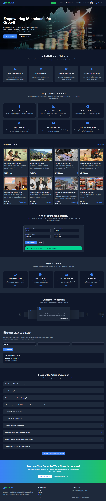
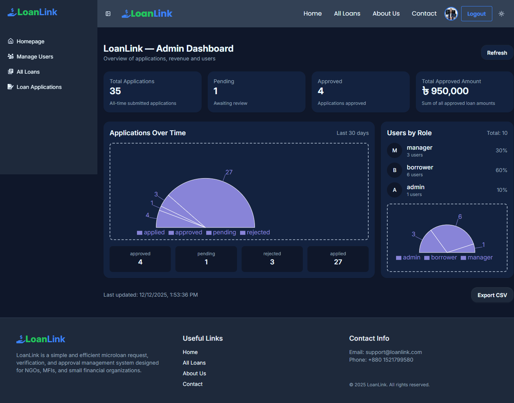

# 💰 LoanLink – Smart & Secure Loan Management System

## 💰 LoanLink Home Page

## 💰 LoanLink Dashboard



## 🧩 Description

**LoanLink** is a full-featured loan management platform built with React, Firebase Authentication, MongoDB, and modern UI tools.
Users can explore available loans, apply online, track application status, and manage their personal loan dashboard.
Admins and Managers can manage users, approve/reject applications, and monitor system activity.

## 🚀 Live Demo

- **Frontend:** 🔗 [View Deployed App](https://loan-link-client.netlify.app)  
- **Backend:** 🔗 [View Backend API](https://loan-link-server-phi.vercel.app)

## 💡 Features

### User Features
- Browse available loans with limits, descriptions, and interest rates
- Apply for a loan through a dynamic application form
- Automatic application status update flow:
    - applied → pending → approved/rejected
- Pay application fee & confirm submission
- View personal loans in “My Loans”
- User profile management
- View loan details
- Confetti animation on successful 

## Admin / Manager Features
- Manage users (promote, suspend, update roles)
- Manage loan categories & loan items
- Approve or reject loan applications
- Monitor pending and approved applications
- Secure role-based dashboard system

## Global Features
- Firebase Authentication
- Protected Routes using React Router
- SweetAlert2 confirmation modals
- React Hot Toast notifications
- Recharts analytics
- Lottie animations
- Responsive UI with Tailwind + DaisyUI
- React Query for server caching and API management

## 🧰 Technologies Used

| Technology           | Purpose                        |
| -------------------- | ------------------------------ |
| **React.js**         | Frontend framework             |
| **React Router**     | Routing and navigation         |
| **React Query**      | API data caching               |
| **Tailwind CSS**     | Styling                        |
| **DaisyUI**          | Pre-styled UI components       |
| **React Icons**      | Icons for UI elements          |
| **Swiper.js**        | Carousel sliders               |
| **Hot Toast**        | Toast notifications            |
| **Sweet Alert**      | Pop-up alerts                  |
| **Lottie**           | Animated loaders               |
| **Recharts**         | Data visualization             |
| **Axios**            | API requests                   |
| **Firebase**         | Authentication & Firestore     |
| **React Confetti**   | Successful loan application    |
| **Motion (Framer)**  | Smooth animations & transitions|
| **React Hook Form**  | Form handling & validation     |


## ⚙️ Installation & Local Setup
### Frontend Setup

1. Clone the frontend repository:
```js
git clone https://github.com/TanijRoy1/loan-link-client.git
```

2. Navigate to the project folder:
```js
cd loan-link-client
```

3. Install dependencies:
```js
npm install
```

4. Create a `.env` file in the root and add Firebase config.

5. Start the development server:
```js
npm run dev
```

6. The app will run on http://localhost:5173

### Backend Setup

1. Clone the backend repository:
```js
git clone https://github.com/TanijRoy1/loan-link-server.git
```

2. Navigate to the backend folder:
```js
cd loan-link-server
```

3. Install dependencies:
```js
npm install
```

4. Create a `.env` file in the backend root and add MongoDB credentials and Firebase service account keys.


5. Start the backend server:
```js
nodemon index.js
```

6. Backend API will run on http://localhost:3000


## 📍 Application Flow (Loan Request)
- 1️⃣ User browses loan →
- 2️⃣ User clicks "Apply" →
- 3️⃣ User fills the application form →
- 4️⃣ Application status saved as **applied** →
- 5️⃣ After payment → status becomes **pending** →
- 6️⃣ Manager reviews and marks **approved** / **rejected**

## 💡 Author

👤 **Tanij Roy**  
🔗 [GitHub Profile](https://github.com/TanijRoy1)

---